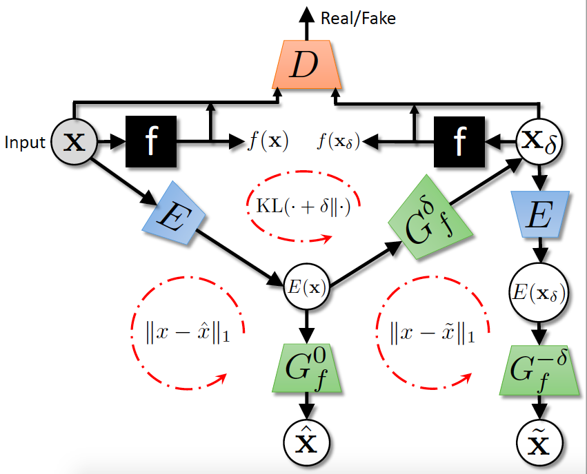
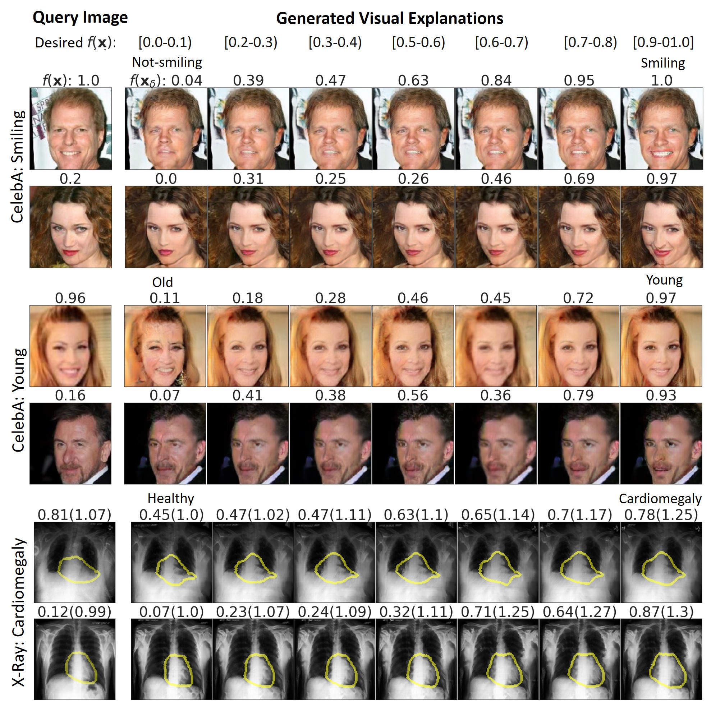

# Explanation_by_Progressive_Exaggeration
Official Tensorflow implementation of ICLR 2020 paper: *Explanation By Progressive Exaggeration*.

[**Paper**](https://openreview.net/forum?id=H1xFWgrFPS)



## Experimental Results

### Qualitative Results



### Age-Attribute Experiment
Training graphs and qualitative results
```
./notebooks/Process_Classifier_Output.ipynb
```

## Installation
```bash
$ pip install -r requirements.txt
```

## Usage
1. Download the CelebA dataset and create train and test fold for the classifier. 

CelebA dataset is downloaded and saved at ./data/CelebA. IPython notebook creates text files with file names and labels and save them at ./data/CelebA/. These text files are used as input data to train the classifier.
```
./notebooks/Data_Processing.ipynb
```
2. Train a classifier. Skip this step if you have a pretrained classifier. The output of the classifier is saved at: $log_dir$/$name$. 

2.a. To train a multi-label classifier on all 40 attributes
```
python train_classifier.py --config 'configs/celebA_DenseNet_Classifier.yaml'
```
2.b. To train a binary classifier on 1 attribute
```
python train_classifier.py --config 'configs/celebA_Smile_DenseNet_Classifier.yaml'
```
3. Process the output of the classifier and create input for Explanation model by discretizing the posterior probability.
The input data for the Explanation model is saved at: $log_dir$/$name$/explainer_input/
```
./notebooks/Process_Classifier_Output.ipynb
```

4. Trainer explainer model. The output is saved at: $log_dir$/$name$.
```
python train_explainer.py --config 'configs/celebA_Young_Explainer.yaml'
```

5. Explore the trained Explanation model and see qualitative results.
```
./notebooks/Test_Explainer.ipynb
```

6. Save results of the trained Explanation model for quantitative experiments.
```
python test_explainer.py --config 'configs/celebA_Young_Explainer.yaml'
```

7. Use the saved results to perform experiments as shown in paper
```
./notebooks/Experiment_CelebA.ipynb 
```
# Cite

```
@inproceedings{
Singla2020Explanation,
title={Explanation  by Progressive  Exaggeration},
author={Sumedha Singla and Brian Pollack and Junxiang Chen and Kayhan Batmanghelich},
booktitle={International Conference on Learning Representations},
year={2020},
url={https://openreview.net/forum?id=H1xFWgrFPS}
}
```
